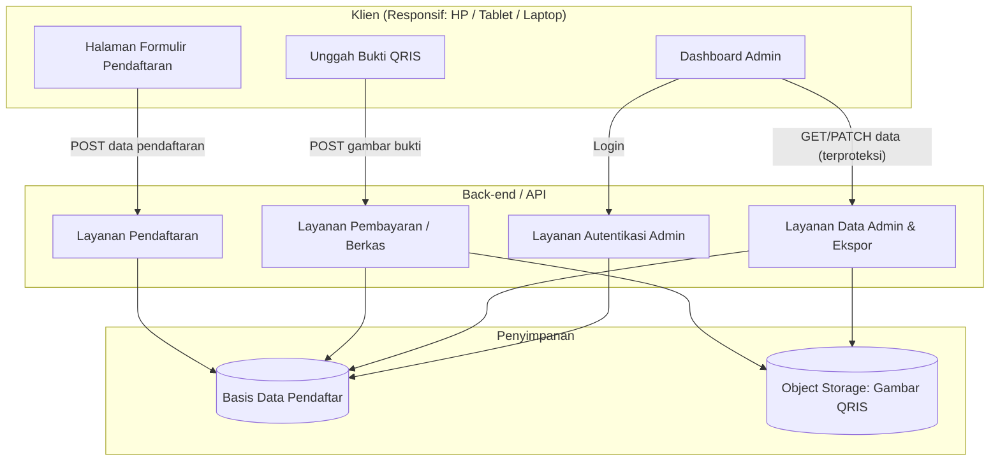
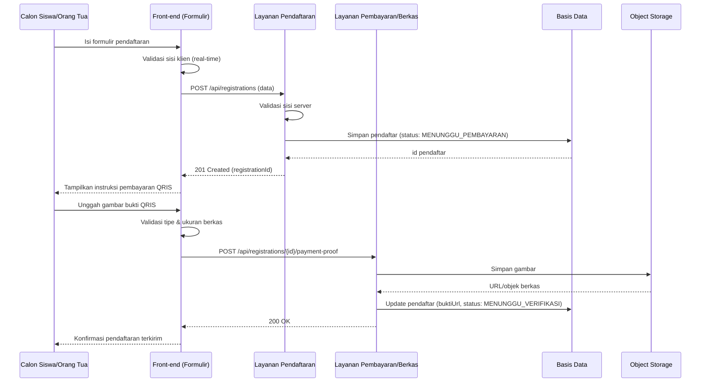
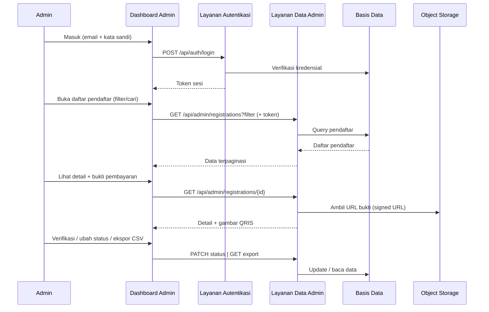

# Dokumen Desain: Pendaftaran Bimbel (Widya Akademi)

## Ringkasan (Overview)

Fitur ini adalah sebuah website pendaftaran bimbingan belajar (bimbel) yang menggantikan alur pendaftaran manual berbasis Google Sheets. Website menyediakan **formulir pendaftaran** yang dapat diisi calon siswa/orang tua, sebuah fitur **unggah bukti pembayaran QRIS**, serta **dashboard admin** untuk melihat, memfilter, dan mengelola data pendaftar secara terpusat.

Tujuan utama desain ini adalah menghadirkan pengalaman yang responsif dan andal di semua perangkat (smartphone, tablet, laptop), sekaligus memberikan admin sumber data tunggal (single source of truth) yang menggantikan spreadsheet. Sistem dirancang sebagai aplikasi web modern dengan pemisahan jelas antara antarmuka publik (formulir pendaftaran) dan antarmuka terproteksi (dashboard admin).

Pendekatan arsitektur bersifat *client–server*: front-end responsif untuk pengisian formulir dan tampilan admin, back-end API untuk validasi dan penyimpanan data, basis data untuk menyimpan pendaftar, serta penyimpanan berkas (object storage) untuk gambar bukti pembayaran QRIS. Desain ini bersifat *technology-agnostic* — semua kontrak antarmuka ditulis dalam pseudocode agar dapat diimplementasikan dengan tumpukan teknologi apa pun yang dipilih tim nanti.

> **⚠️ Asumsi yang perlu dikonfirmasi (Field Formulir):**
> Pengguna menyebutkan adanya dokumen ("docs") yang mendefinisikan field formulir secara pasti, namun isi dokumen tersebut **tidak tersedia** saat desain ini dibuat. Oleh karena itu, field formulir di bawah menggunakan **field pendaftaran bimbel yang umum** sebagai asumsi sementara:
> nama siswa, nama orang tua/wali, nomor kontak/HP, email, asal sekolah, jenjang/kelas, dan program/paket yang dipilih.
> **Mohon dikonfirmasi atau kirimkan isi dokumen "docs"** agar field dapat disesuaikan sebelum implementasi. Bagian [Data Models](#data-models) menandai field mana yang merupakan asumsi.

---

## Arsitektur (Architecture)

### Diagram Arsitektur Tingkat Tinggi



### Alur Utama (Sequence Diagram)

**1. Alur Pendaftaran + Unggah Bukti QRIS**



**2. Alur Admin Meninjau Data**



### Prinsip Arsitektur

- **Pemisahan area publik dan admin**: endpoint pendaftaran bersifat publik; semua endpoint admin membutuhkan autentikasi.
- **Mobile-first & responsif**: tata letak dirancang mulai dari layar terkecil, lalu ditingkatkan (progressive enhancement) untuk layar besar.
- **Sumber data tunggal**: basis data menggantikan Google Sheets, dengan kemampuan ekspor CSV agar migrasi/kebiasaan lama tetap terdukung.
- **Penyimpanan berkas terpisah**: gambar QRIS disimpan di object storage, bukan di dalam basis data, dan diakses melalui URL bertanda tangan (signed URL) yang berlaku sementara.

---

## Komponen dan Antarmuka (Components and Interfaces)

### Komponen 1: Halaman Formulir Pendaftaran (Front-end Publik)

**Tujuan**: Menampilkan formulir pendaftaran yang responsif dan memvalidasi input secara real-time sebelum dikirim ke server.

**Tanggung jawab**:
- Menampilkan field formulir sesuai [Data Models](#data-models).
- Validasi sisi klien (format email, nomor HP, field wajib).
- Menampilkan pesan galat yang jelas dan mudah dibaca di layar kecil.
- Menampilkan instruksi pembayaran QRIS setelah pendaftaran berhasil.

**Antarmuka**:

```pascal
INTERFACE KomponenFormulirPendaftaran
  PROSEDUR render(konfigurasiField): TampilanFormulir
  FUNGSI validasiKlien(dataFormulir): HasilValidasi   // { valid: boolean, galat: List<PesanGalat> }
  FUNGSI kirim(dataFormulir): Promise<HasilPendaftaran> // memanggil POST /api/registrations
END INTERFACE
```

### Komponen 2: Komponen Unggah Bukti QRIS

**Tujuan**: Memungkinkan pengguna mengunggah gambar bukti pembayaran QRIS dan mengaitkannya dengan pendaftaran.

**Tanggung jawab**:
- Menampilkan gambar/target pembayaran QRIS bimbel.
- Menerima berkas gambar (jpg/png/webp), memvalidasi tipe & ukuran.
- Menampilkan pratinjau (preview) sebelum unggah.
- Mengunggah berkas ke `POST /api/registrations/{id}/payment-proof`.

**Antarmuka**:

```pascal
INTERFACE KomponenUnggahQRIS
  FUNGSI pilihBerkas(berkas): HasilValidasiBerkas   // cek tipe MIME & ukuran maks
  FUNGSI tampilkanPratinjau(berkas): URLPratinjau
  FUNGSI unggah(registrationId, berkas): Promise<HasilUnggah>
END INTERFACE
```

### Komponen 3: Dashboard Admin (Front-end Terproteksi)

**Tujuan**: Memberi admin tampilan terpusat data pendaftar sebagai pengganti Google Sheets.

**Tanggung jawab**:
- Autentikasi admin (login/logout, sesi).
- Menampilkan daftar pendaftar dengan pencarian, filter (status/program/jenjang), sortir, dan paginasi.
- Menampilkan detail pendaftar termasuk melihat gambar bukti QRIS.
- Mengubah status pendaftar (mis. verifikasi pembayaran) dan mengekspor data ke CSV.

**Antarmuka**:

```pascal
INTERFACE DashboardAdmin
  FUNGSI masuk(email, kataSandi): Promise<SesiAdmin>
  FUNGSI ambilDaftar(filter, halaman, ukuranHalaman): Promise<HalamanPendaftar>
  FUNGSI ambilDetail(registrationId): Promise<DetailPendaftar>
  FUNGSI ubahStatus(registrationId, statusBaru): Promise<HasilUpdate>
  FUNGSI eksporCSV(filter): Promise<BerkasCSV>
END INTERFACE
```

### Komponen 4: Layanan Pendaftaran (Back-end)

**Tujuan**: Menerima, memvalidasi, dan menyimpan data pendaftaran.

**Tanggung jawab**:
- Validasi sisi server (otoritatif) atas seluruh field.
- Menyimpan pendaftar baru dengan status awal `MENUNGGU_PEMBAYARAN`.
- Mengembalikan `registrationId` untuk dikaitkan dengan unggahan bukti.

**Antarmuka**:

```pascal
INTERFACE LayananPendaftaran
  FUNGSI buatPendaftaran(data): HasilPendaftaran
  // Prakondisi: data lolos validasi server
  // Postkondisi: satu baris pendaftar tersimpan, status = MENUNGGU_PEMBAYARAN
END INTERFACE
```

### Komponen 5: Layanan Pembayaran / Berkas (Back-end)

**Tujuan**: Mengelola unggahan gambar bukti QRIS dan mengaitkannya dengan pendaftar.

**Tanggung jawab**:
- Memvalidasi tipe MIME & ukuran berkas di sisi server.
- Menyimpan gambar ke object storage.
- Memperbarui record pendaftar dengan referensi berkas & mengubah status menjadi `MENUNGGU_VERIFIKASI`.

**Antarmuka**:

```pascal
INTERFACE LayananPembayaran
  FUNGSI unggahBukti(registrationId, berkas): HasilUnggah
  // Prakondisi: registrationId valid; berkas berupa gambar yang diizinkan
  // Postkondisi: berkas tersimpan di object storage; buktiUrl terisi; status = MENUNGGU_VERIFIKASI
END INTERFACE
```

### Komponen 6: Layanan Autentikasi & Data Admin (Back-end)

**Tujuan**: Mengamankan akses admin dan menyediakan query data pendaftar serta ekspor.

**Tanggung jawab**:
- Verifikasi kredensial admin dan penerbitan token sesi.
- Query terpaginasi dengan filter untuk daftar pendaftar.
- Menghasilkan signed URL untuk melihat bukti QRIS.
- Menghasilkan berkas CSV dari data terfilter.

**Antarmuka**:

```pascal
INTERFACE LayananAdmin
  FUNGSI login(email, kataSandi): SesiAdmin
  FUNGSI daftarPendaftar(token, filter, halaman, ukuran): HalamanPendaftar
  FUNGSI detailPendaftar(token, registrationId): DetailPendaftar
  FUNGSI perbaruiStatus(token, registrationId, status): HasilUpdate
  FUNGSI ekspor(token, filter): BerkasCSV
END INTERFACE
```

### Ringkasan Endpoint API

| Method | Endpoint | Akses | Deskripsi |
|--------|----------|-------|-----------|
| POST | `/api/registrations` | Publik | Membuat pendaftaran baru |
| POST | `/api/registrations/{id}/payment-proof` | Publik (dengan id) | Mengunggah bukti QRIS |
| POST | `/api/auth/login` | Publik | Login admin |
| POST | `/api/auth/logout` | Admin | Logout admin |
| GET | `/api/admin/registrations` | Admin | Daftar pendaftar (filter, cari, paginasi) |
| GET | `/api/admin/registrations/{id}` | Admin | Detail pendaftar + signed URL bukti |
| PATCH | `/api/admin/registrations/{id}/status` | Admin | Ubah status pendaftar |
| GET | `/api/admin/registrations/export` | Admin | Ekspor CSV |

---

## Model Data (Data Models)

### Model 1: Pendaftar (Registration)

```pascal
STRUKTUR Pendaftar
  id: UUID
  namaSiswa: String            // ASUMSI field
  namaOrangTua: String         // ASUMSI field
  nomorHP: String              // ASUMSI field
  email: String                // ASUMSI field (opsional?)
  asalSekolah: String          // ASUMSI field
  jenjang: Enum { SD, SMP, SMA, LAINNYA }   // ASUMSI field
  kelas: String                // ASUMSI field (mis. "Kelas 6", "Kelas 10")
  program: String              // ASUMSI field (paket/program bimbel yang dipilih)
  catatan: String              // opsional
  status: StatusPendaftaran
  buktiPembayaranUrl: String   // referensi objek di object storage (bisa kosong)
  dibuatPada: Timestamp
  diperbaruiPada: Timestamp
END STRUKTUR

ENUM StatusPendaftaran {
  MENUNGGU_PEMBAYARAN   // pendaftaran dibuat, belum unggah bukti
  MENUNGGU_VERIFIKASI   // bukti diunggah, menunggu admin
  TERVERIFIKASI         // pembayaran diverifikasi admin
  DITOLAK               // bukti tidak valid / ditolak
}
```

**Aturan Validasi**:
- `namaSiswa`, `namaOrangTua`, `nomorHP`, `asalSekolah`, `jenjang`, `program` = **wajib** (asumsi; menunggu konfirmasi dokumen "docs").
- `nomorHP`: hanya digit (opsional awalan `+`), panjang 8–15.
- `email`: format email valid jika diisi.
- `program`: harus salah satu dari daftar program yang tersedia (lihat Model 3).
- `status`: hanya transisi yang sah (lihat [Correctness Properties](#correctness-properties)).

> Semua field bertanda **ASUMSI** akan disesuaikan setelah isi dokumen "docs" dikonfirmasi.

### Model 2: Admin

```pascal
STRUKTUR Admin
  id: UUID
  email: String
  kataSandiHash: Hash    // TIDAK PERNAH menyimpan kata sandi mentah
  nama: String
  dibuatPada: Timestamp
END STRUKTUR
```

**Aturan Validasi**:
- `email` unik dan berformat valid.
- `kataSandiHash` hasil hashing kuat (mis. bcrypt/argon2), bukan teks biasa.

### Model 3: Program Bimbel (Referensi)

```pascal
STRUKTUR Program
  id: UUID
  nama: String          // mis. "Intensif SMA IPA", "Reguler SMP"
  deskripsi: String
  harga: Integer        // dalam Rupiah
  aktif: Boolean
END STRUKTUR
```

**Aturan Validasi**:
- Hanya program dengan `aktif = true` yang ditampilkan pada formulir publik.

### Model 4: Bukti Pembayaran (metadata berkas)

```pascal
STRUKTUR BuktiPembayaran
  registrationId: UUID
  namaBerkas: String
  tipeMime: String       // image/jpeg, image/png, image/webp
  ukuranByte: Integer
  kunciObjek: String     // lokasi di object storage
  diunggahPada: Timestamp
END STRUKTUR
```

**Aturan Validasi**:
- `tipeMime` ∈ { image/jpeg, image/png, image/webp }.
- `ukuranByte` ≤ batas maksimum (mis. 5 MB).

---

## Correctness Properties

Properti berikut harus selalu benar (universal) untuk menjamin kebenaran sistem:

1. **Integritas status**: Untuk setiap `Pendaftar p`, `p.status` selalu salah satu nilai `StatusPendaftaran` yang sah.
2. **Transisi status sah**: Perubahan status hanya mengikuti alur:
   `MENUNGGU_PEMBAYARAN → MENUNGGU_VERIFIKASI → (TERVERIFIKASI | DITOLAK)`. `DITOLAK` dapat kembali ke `MENUNGGU_VERIFIKASI` jika bukti baru diunggah. Tidak ada transisi lain yang diizinkan.
3. **Keterkaitan bukti**: Untuk setiap `Pendaftar p` dengan `p.status ∈ {MENUNGGU_VERIFIKASI, TERVERIFIKASI}`, maka `p.buktiPembayaranUrl` tidak kosong.
4. **Validasi wajib**: Tidak ada `Pendaftar` yang tersimpan tanpa seluruh field wajib terisi dan lolos validasi server.
5. **Isolasi akses admin**: Setiap permintaan ke endpoint `/api/admin/*` yang tidak menyertakan sesi/token valid akan ditolak (401), tanpa membocorkan data.
6. **Keamanan berkas**: Setiap berkas yang tersimpan sebagai bukti memenuhi `tipeMime` dan `ukuranByte` yang diizinkan.
7. **Idempoten unggah**: Mengunggah ulang bukti untuk `registrationId` yang sama menggantikan bukti sebelumnya tanpa membuat pendaftar ganda.
8. **Konsistensi ekspor**: Data hasil ekspor CSV mencerminkan data yang sama dengan yang ditampilkan pada dashboard untuk filter yang identik.

---

## Penanganan Galat (Error Handling)

### Skenario 1: Validasi formulir gagal
**Kondisi**: Field wajib kosong atau format tidak valid.
**Respon**: Server mengembalikan `400 Bad Request` dengan daftar galat per-field; front-end menandai field bermasalah dengan pesan jelas.
**Pemulihan**: Pengguna memperbaiki input dan mengirim ulang; tidak ada data tersimpan sampai valid.

### Skenario 2: Berkas bukti tidak valid
**Kondisi**: Tipe MIME tidak diizinkan atau ukuran melebihi batas.
**Respon**: `400 Bad Request` / `413 Payload Too Large` dengan pesan spesifik (mis. "Hanya JPG/PNG/WebP maks 5 MB").
**Pemulihan**: Pengguna memilih berkas lain; pendaftaran tetap ada dengan status `MENUNGGU_PEMBAYARAN`.

### Skenario 3: Gagal menyimpan ke penyimpanan
**Kondisi**: Basis data atau object storage tidak tersedia.
**Respon**: `503 Service Unavailable`; tidak ada perubahan sebagian (operasi bersifat atomik/rollback).
**Pemulihan**: Pengguna diminta mencoba lagi; sistem mencatat log untuk investigasi.

### Skenario 4: Akses admin tidak sah
**Kondisi**: Token sesi kedaluwarsa/absen.
**Respon**: `401 Unauthorized`; UI mengarahkan ke halaman login.
**Pemulihan**: Admin login kembali.

### Skenario 5: Pendaftar tidak ditemukan
**Kondisi**: `registrationId` tidak ada saat unggah bukti atau lihat detail.
**Respon**: `404 Not Found`.
**Pemulihan**: Menampilkan pesan bahwa data tidak ditemukan.

---

## Strategi Pengujian (Testing Strategy)

### Pengujian Unit
- Validasi field (email, nomor HP, field wajib) di sisi klien dan server.
- Validasi tipe & ukuran berkas.
- Logika transisi status pendaftaran.

### Pengujian Berbasis Properti (Property-Based Testing)
- **Properti transisi status**: untuk urutan aksi acak, status akhir selalu mengikuti transisi yang sah (Correctness Property #2).
- **Properti validasi**: data acak yang tidak lengkap selalu ditolak; data lengkap yang valid selalu diterima.
- **Pustaka yang disarankan**: `fast-check` (JS/TS) atau `hypothesis` (Python), tergantung tumpukan yang dipilih.

### Pengujian Integrasi
- Alur end-to-end: isi formulir → simpan → unggah bukti → status berubah.
- Alur admin: login → filter/cari → lihat detail → ubah status → ekspor CSV.
- Uji otorisasi: endpoint admin menolak permintaan tanpa token.

### Pengujian Responsif / UI
- Verifikasi tata letak pada breakpoint umum: ponsel (±360–414px), tablet (±768px), laptop (≥1024px).
- Uji ketergunaan komponen unggah pada perangkat sentuh (touch), termasuk kamera ponsel.

---

## Pertimbangan Performa (Performance Considerations)

- **Paginasi wajib** pada daftar pendaftar admin untuk menghindari memuat seluruh data sekaligus.
- **Indeks basis data** pada kolom yang sering difilter/dicari (status, program, jenjang, dibuatPada).
- **Kompresi/optimasi gambar**: batasi ukuran unggah dan sajikan pratinjau ringan pada dashboard.
- **Signed URL** dengan masa berlaku singkat untuk mengurangi beban dan menjaga keamanan akses gambar.
- **Aset front-end** dioptimalkan (lazy-load gambar, bundle minimal) demi performa di jaringan seluler.

---

## Pertimbangan Keamanan (Security Considerations)

- **Autentikasi admin**: kata sandi disimpan sebagai hash kuat (bcrypt/argon2); sesi menggunakan token dengan masa berlaku dan mekanisme logout.
- **Otorisasi**: semua endpoint `/api/admin/*` memvalidasi sesi sebelum memproses.
- **Validasi input server-side** untuk mencegah injeksi dan data cacat (jangan mengandalkan validasi klien saja).
- **Keamanan unggahan berkas**: batasi tipe MIME & ukuran, hasilkan nama objek acak, jangan mengeksekusi berkas, sajikan melalui signed URL.
- **Perlindungan data pribadi**: data siswa/orang tua bersifat sensitif — gunakan HTTPS, batasi akses hanya untuk admin, dan pertimbangkan kebijakan retensi.
- **Rate limiting** pada endpoint publik (`/api/registrations`, login) untuk mencegah spam/brute-force.
- **Perlindungan CSRF/CORS** sesuai konfigurasi front-end dan back-end.

---

## Dependensi (Dependencies)

Karena tumpukan teknologi belum ditentukan, berikut kategori dependensi yang dibutuhkan (implementasi konkret ditentukan kemudian):

- **Front-end**: framework UI responsif dengan dukungan komponen formulir & unggah berkas.
- **Back-end / API**: kerangka kerja server untuk REST API dan middleware autentikasi.
- **Basis data**: penyimpanan relasional/dokumen untuk data pendaftar, admin, dan program.
- **Object storage**: penyimpanan berkas gambar bukti QRIS (mis. layanan object storage cloud atau setara).
- **Autentikasi**: pustaka hashing kata sandi (bcrypt/argon2) dan pengelolaan token sesi/JWT.
- **Ekspor CSV**: pustaka pembuatan CSV.
- **Pengujian**: kerangka uji unit + pustaka property-based testing (fast-check/hypothesis).

---

## Pertanyaan Terbuka (Open Questions)

1. **Isi dokumen "docs"**: Field formulir yang pasti — apakah sesuai asumsi di atas? Adakah field tambahan (mis. tanggal lahir, jenis kelamin, jam belajar yang diinginkan, sumber informasi)?
2. **Program bimbel**: Daftar program/paket dan harga yang tersedia.
3. **Verifikasi pembayaran**: Apakah admin memverifikasi manual, atau perlu integrasi otomatis dengan penyedia QRIS?
4. **Notifikasi**: Apakah perlu notifikasi (email/WhatsApp) ke pendaftar setelah verifikasi?
5. **Multi-admin & peran**: Apakah ada lebih dari satu admin dengan peran berbeda?
